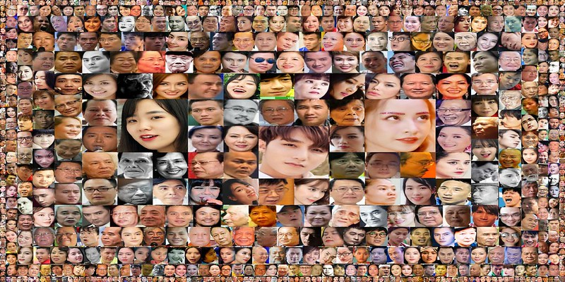
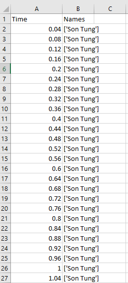
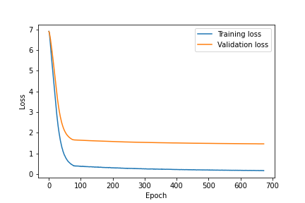
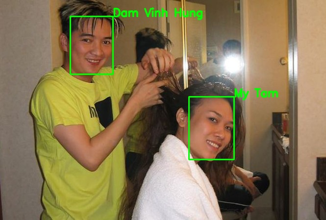
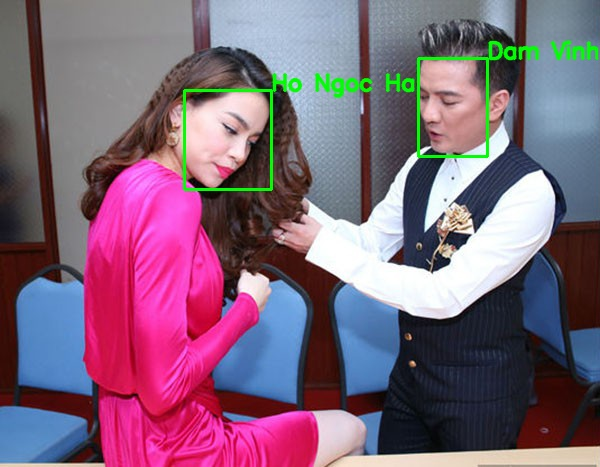
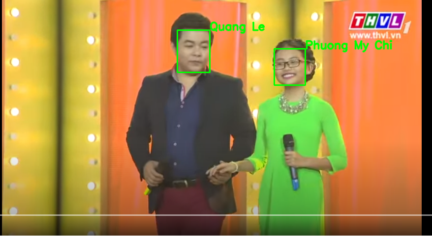
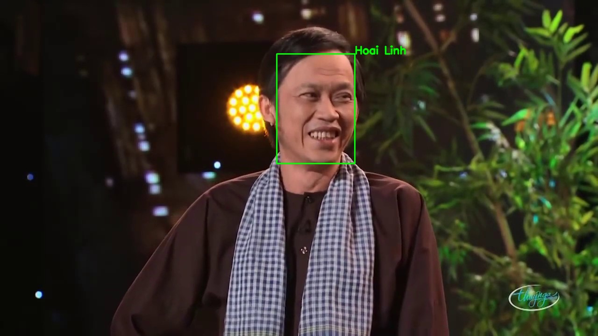

# Face Recognition For Viet Nam Celebrity Dataset Using Deep Learning Model
This repository contains code for training face recognition from embedding
vectors calculated from pre-trained [FaceNet](https://arxiv.org/abs/1503.03832)
model. Particularly, face recognition process includes three steps: 

1. Face detection using [MTCNN](https://arxiv.org/abs/1503.03832)

2. Face embedding using encoder
   [InceptionResnetV1](https://github.com/timesler/facenet-pytorch)

3. Embedding classification by [multilayer perceptron
   (MLP)](https://en.wikipedia.org/wiki/Multilayer_perceptron)

## Usage
Follow below instructions for calculating embedding vectors and training from
them: 

1. Download [VN celebrity](https://www.aivivn.com/contests/2) dataset and unzip
   it to repository folder.

2. Run `python3 split_train_val.py -d train.csv -o vn_celeb.json -tr train.json
   -v val.json` to create two JSON files indicating images for training and
   validation respectively.

3. Run `python find_embedding.py -d train -bz 64 -o train_emb` to calculate
   embedding vectors for all images in training set of dataset.

4. Run `python train.py -c cfg/train_cfg_emb_classify.json` to train MLP model
   classifying embedding with default setting. After training, checkpoints and logs in this process are saved in
   folders `saved/models/run_id` and `saved/logs/run_id` respectively. Note
   that `run_id` is automatically generated when running instructions and it
   is unique.

## Supports
**Note**: Because VN celebrity dataset do not provide person name of label, I
searched names of some labels and put them in `cfg/label2name.txt` with `csv`
format. If you want to use classification model in a comprehensive way, please
search and complete names of all labels. If the
prediction label is not found in this file, the prediction name is `Unknown`.

### Face recognition for an image
You can use trained MLP model for recognizing people in an image (follow
mentioned three steps), namely by running: 
```
python demo_image.py -i input_image.jpg -o input_image_recog.jpg -m
checkpoint-epoch650.pth -fs 160 -l2n cfg/label2name.txt
```

### Face recognition for a video
The frames extracted from a video are pushed into one-image face recognition
process. The following instruction outputs a `tracker.csv` file with two
columns `Time` and `Names` describing time in video (mesured in second) and
appearing people respectively: 
```
python demo_video.py -i video_input.mp4 -o output_frames -m checkpoint-epoch650.pth -fs 160 -l2n cfg/label2name.txt -ot tracker.csv
```
Tracker file:


If you want to export face recognition version of original video, add `-ov
video_input_recog.mp4` argument.

## Results
For every person in dataset except the one has only one describing image, I
chose one image from them for validation. Therefore, the new training set and
validation set have
**3804** samples and **916** samples respectively. I used **P100** GPU on `Colab` for training and
achieved the following results: 
### Training and validation loss

#### Metrics
|Metrics| Training | Validation |
|-------|----------|------------|
|CE loss| 0.1751 | 1.4697 |
|Accuracy| 99.21 %| 74.24 % |

### Face recognition on an image




